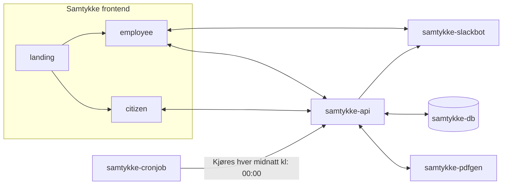

# samtykke
Frontend for NAV's digital samtykkeløsning, løsningen for opprettelse og behandling av digitale samtykker til brukertester hos NAV.

## Frontend apper
Det visuelle til samtykke-løsningen er splittet opp i 3 forskjellige React apper: `landing`, `employee`, og `citizen`.

[landing](/landing) \
Landings-siden for samtykke-løsningen med navigering videre til ansatt eller innbygger sidene i løsningen.

[employee](/employee) \
Ansatt-siden for samtykke-løsningen hvor en NAV-ansatt kan opprette samtykker og se status for eksisterende samtykker.

[citizen](/citizen) \
Innbygger-siden for samtykke-løsningen hvor Norske innbyggere kan gi og behandle samtykker opprettet av NAV-ansatte. 

## Andre apper i løsningen
Resten av samtykke-løsningen består av 4 apper: `samtykke-api`, `samtykke-pdfgen`, `samtykke-slackbot` og `samtykke-cronjob`.

[samtykke-api](https://github.com/navikt/samtykke-api) \
API for håndteringen av dataen knyttet til samtykker og proxy videre til PDF-generering.

[samtykke-pdfgen](https://github.com/navikt/samtykke-pdfgen) \
Generering av samtykker på PDF.

[samtykke-slackbot](https://github.com/navikt/samtykke-slackbot) \
Varsling om hendelser tilknyttet et spesifikt samtykke på Slack.

[samtykke-cronjob](https://github.com/navikt/samtykke-cronjob) \
Prosess for å be `samtykke-api` om å slette samtykker og relatert data som har utløpt.

## Flyt for hele løsningen

## For NAV-ansatte
Interne hendveldenser kan sendes på Slack via kanalene `#researchops` eller `#samtykke-løsning`.